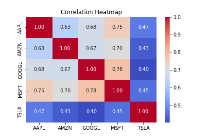
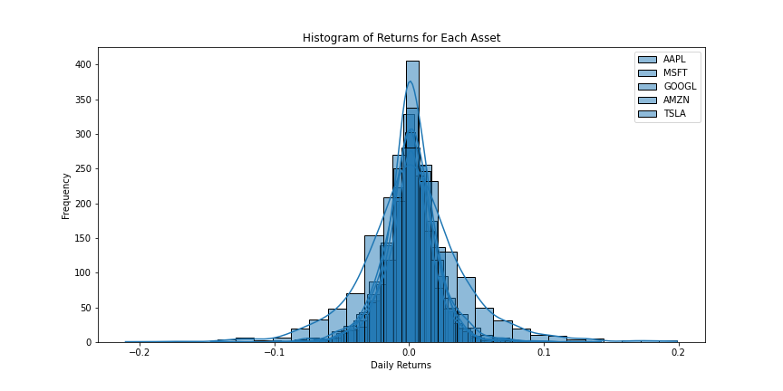
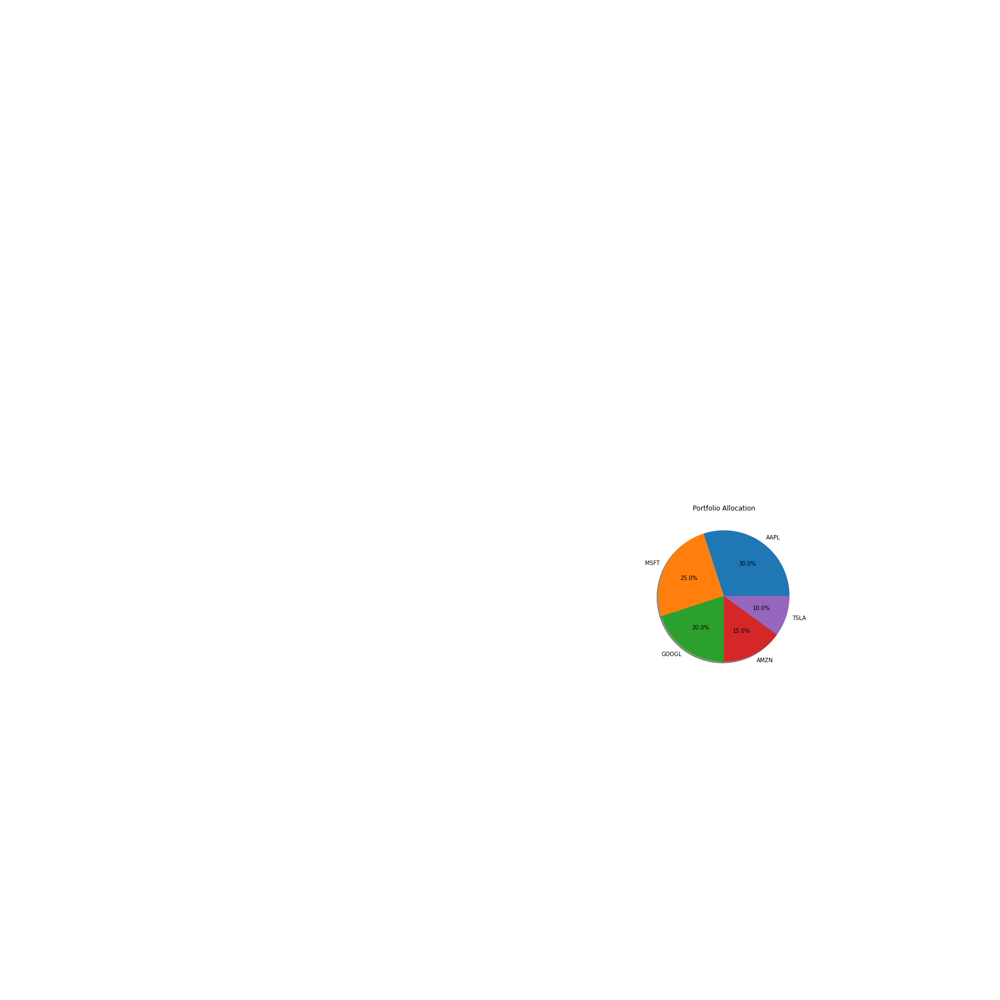
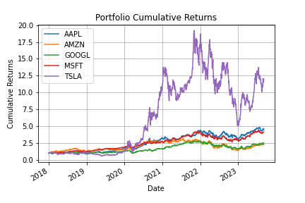
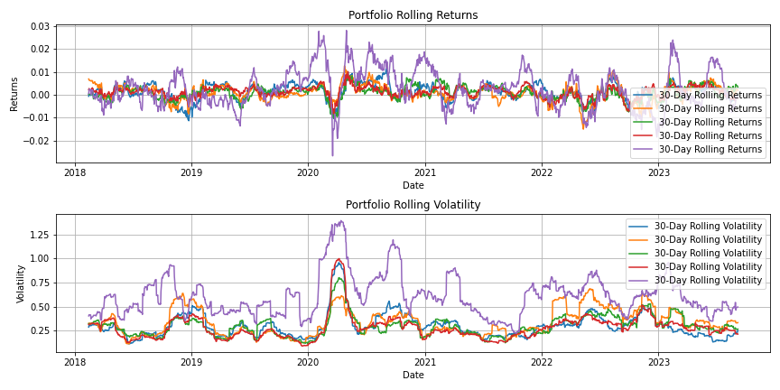

# Portfolio Analysis


## Overview

This Jupyter Notebook project demonstrates a comprehensive analysis of a portfolio of stocks using Python and the yfinance library. It covers various aspects of portfolio management, including calculating performance metrics, visualizing data, and gaining insights into risk and return. The analysis is conducted on a portfolio consisting of well-known technology stocks, but you can easily customize it for your own portfolio.

## Table of Contents

- [Getting Started](#getting-started)
- [Prerequisites](#prerequisites)
- [Installation](#installation)
- [Running the Notebook](#running-the-notebook)
- [Project Structure](#project-structure)
- [Code Explanation](#code-explanation)
- [Visualizations](#visualizations)
- [Project Insights](#project-insights)


## Getting Started

### Prerequisites

Before running the Jupyter Notebook, make sure you have the following prerequisites installed on your system:

- Python 3.x (Recommended: [Anaconda Distribution](https://www.anaconda.com/distribution))
- Jupyter Notebook (Installed via Anaconda or [Jupyter](https://jupyter.org/install))
- Required Python packages (Install using `pip` or `conda`):
  - yfinance
  - pandas
  - numpy
  - matplotlib
  - seaborn

### Installation

1. Clone the repository to your local machine:

   ```git clone https://github.com/RichieGarafola/portfolio-analysis.git
   
   cd portfolio-analysis
   
2. Create a virtual environment (optional but recommended):
    
        conda create -n portfolio-analysis python=3.8
        conda activate portfolio-analysis
        
3. Install the required Python packages:
    
        pip install -r requirements.txt
        
## Running the Notebook

1. Start the Jupyter Lab
        jupyter lab
        
2. Open the PortfolioAnalysis.ipynb notebook from the Jupyter interface.

3. Execute each cell of the notebook in sequential order by pressing Shift + Enter. Follow the code explanations and visualizations.

## Project Structure

The project directory structure is organized as follows:

- portfolio_analysis.ipynb: The Jupyter Notebook containing the project code and analysis.

- requirements.txt: A list of required Python packages for this project.

- images/: Directory to store any project-related images, such as visualizations.

## Code Explanation

The Jupyter Notebook PortfolioAnalysis.ipynb is divided into sections, each serving a specific purpose. Here's an overview of the main sections:

### Data Retrieval and Preparation
- Download historical stock data for a list of specified portfolio symbols.
- Calculate daily returns for each stock.
- Prepare the data for analysis.

### Portfolio Metrics Calculation
- Calculate essential portfolio metrics, including annualized return, annualized volatility, and the Sharpe ratio.
- Assess the maximum drawdown and additional statistics such as annualized standard deviation and rolling statistics.
- Compute Value at Risk (VaR) and Conditional Value at Risk (CVaR) at a 95% confidence level.

## Visualizations
- Plot key visualizations to gain insights into portfolio performance, risk, and asset allocation.
- Visualizations include a cumulative returns plot, rolling returns and volatility plots, a correlation heatmap, histograms of returns for each asset, and a portfolio allocation pie chart.

## Project Insights
- Interpret the results and insights gained from the analysis.
- Discuss the implications of portfolio metrics, visualizations, and statistics.
- Provide guidance on how to use these insights for portfolio management and investment decisions.

## Visualizations

This project includes various visualizations to help you better understand your portfolio and investment strategies. Here's a brief overview of each visualization:

- Cumulative Returns Plot: Shows the cumulative growth of the portfolio over time, allowing you to assess trends and performance.

- Rolling Returns and Volatility Plots: Illustrate 30-day rolling returns and volatility to identify short-term performance trends and risk fluctuations.

- Correlation Heatmap: Displays correlations between portfolio assets, aiding diversification analysis and risk management.

- Histograms of Returns for Each Asset: Depicts the distribution of daily returns for individual assets, offering insights into risk-return profiles.

- Portfolio Allocation Pie Chart: Provides a visual representation of asset allocation within the portfolio, aiding diversification assessment.

## Project Insights

This section discusses some of the insights you can gain from this analysis:

- Understand portfolio performance, risk, and the Sharpe ratio.
- Customize portfolio allocation and assess the impact on returns and risk.
- Analyze rolling returns and volatility to identify trends and patterns.
- Assess asset correlations for diversification.
- Examine return distributions for individual assets.
- Visualize portfolio allocation to understand the composition of your investments.






